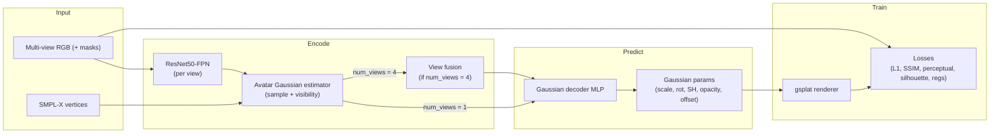

# Gaussian Avatar (NLF-GS)

Train **personalized 3D avatars** from multi-view RGB images. A **ResNet50-FPN** backbone extracts image features; Gaussians live on a fixed **SMPL-X**-anchored template and are decoded into 3D Gaussian Splatting parameters, then rendered with **[gsplat](https://github.com/nerfstudio-project/gsplat)**. Training is driven by **[PyTorch Lightning](https://lightning.ai/)** with photometric and regularization losses.

---

## Data structure

**Processed images (training / inference input)** — root from `data.root` (e.g. `processed/`):

```
<root>/<subject>/
  <subject>_front.(png|jpg|jpeg)   # + optional <subject>_front_mask.*
  <subject>_back.*
  <subject>_left.*
  <subject>_right.*
```

Views follow fixed order: `front`, `back`, `left`, `right`. Masks are optional; if missing, full-image masks are used.

**SMPL-X geometry** — root from `data.smplx_root`:

```
<smplx_root>/<subject>/smplx_param.pkl   # preferred
# or
<smplx_root>/<subject>/mesh_smplx.obj
```

Vertices drive 3D Gaussian placement and 2D feature sampling via precomputed cameras (`data/THuman_cameras/*.json` when using THuman preprocessing).

**Model assets** (paths in config): ResNet weights (`backbone.resnet50_weights_path`), **avatar template** PLY (`avatar_template.path`), canonical SMPL-X mesh (`avatar_template.cano_mesh_path`). Template `mode`: `default` | `generate` | `test` | `anim`.

**Preprocessing:** `python -m src.data.preprocess_thuman` renders THuman 2.0 into the layout above (see script for `DATA_ROOT` and camera output).

---

## Model workflow

Multi-view images and SMPL-X vertices are aligned to a mesh-bound Gaussian template. Per-view FPN features are sampled at projected Gaussian locations; with `data.num_views: 4`, features are **fused** (learned or geometry-weighted), then a shared **MLP decoder** predicts Gaussian parameters (no global identity latent—the decoder is conditioned on fused local features only). The renderer splats Gaussians for each canonical view; losses compare renders to ground-truth images (and masks).



`data.num_views: 1` skips fusion and decodes **per view**; supervision still uses all loaded views.

---

## Dependencies and usage

**Requirements**

- Python 3.10+
- **PyTorch** 2.x (install from [pytorch.org](https://pytorch.org) to match CUDA/OS)
- **CUDA** required for **training** (differentiable gsplat render). **Inference** on CPU can still export a Gaussian PLY; canonical-view PNG renders need CUDA.
- **`gsplat`** (install separately, e.g. `pip install gsplat`, after PyTorch)

```bash
pip install -r requirements.txt
# then: pip install gsplat   # if not already satisfied
```

**Train**

```bash
export NLFGS_CONFIG=configs/nlfgs_gpu.yaml   # optional; train.py sets this from --config
python train.py --config configs/nlfgs_gpu.yaml
```

**Inference** (single subject, four views; PLY + optional canonical PNGs on CUDA)

```bash
python inference.py --config configs/nlgfs_test.yaml --subject <folder_name> --checkpoint <path/to.ckpt>
```

Set `inference.checkpoint` in YAML or pass `--checkpoint`. Output directory and PLY options: `inference.*` in the config.

**Debug:** `sys.debug: true` caps dataset size for quick runs.

**Export:** Gaussian PLY via `reconstruct_gaussian_avatar_as_ply` in `src/avatar_utils/ply_loader.py` (e.g. viewers such as [SuperSplat](https://superspl.at/editor)).
